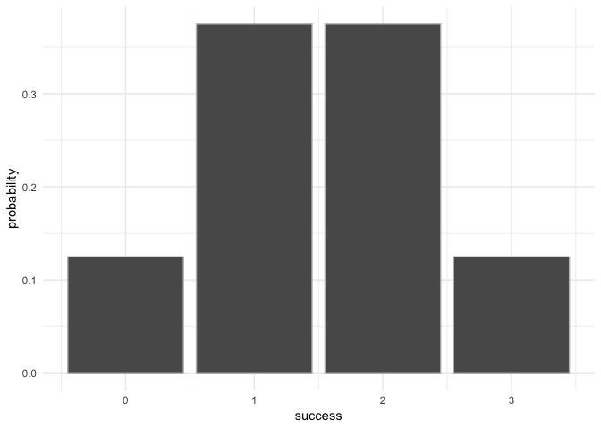
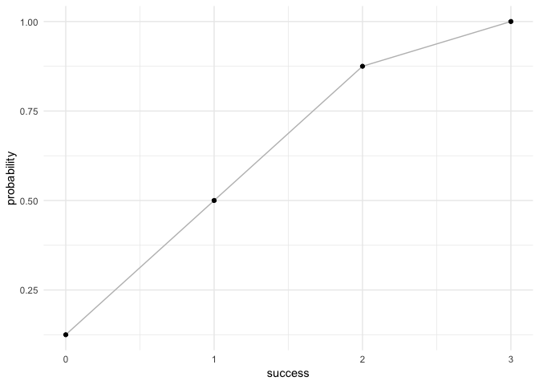

Overview
--------

`"binomial"` is a minimal package that provides functions to execute
basic functions of binomial distribution.

-   `bin_choose()` computes the number of success given trials.
-   `bin_cumulative()` compute cumulative distribution given trials and
    success probability.
-   `bin_distribution()` compute distribution given trials and success
    probability.
-   `bin_kurtosis()` compute kurtosis given trials and success
    probability.
-   `bin_mean()` compute mean given trials and success probability.
-   `bin_mode()` compute mode given trials and success probability.
-   `bin_probability()` compute probability given sucess, trials and
    success probability.
-   `bin_skewness()` compute skewness given trials and success
    probability.
-   `bin_variable()` show variables of trials and success probability.
-   `bin_variance()` compute variance given trials and success
    probability.
-   `plot.bincum()` plot the cumulatative distribution given trials and
    success probability.
-   `print.binvar()` print the `bin_variable` object.
-   `print.summary.binvar()` print the summary of `bin_variable` object.
-   `bin_varisummary.binvarable()` show the summary of `bin_variable`
    object.

Motivation
----------

The package is used to perform basic calculations of binomial variables.

Installation
------------

    # development version from GitHub:
    #install.packages("devtools") 

    # install "binomial" (without vignettes)
    devtools::install_github("stat133-sp19/hw-stat133-kiraguostat/binomial")

    # install "binomial" (with vignettes)
    devtools::install_github("stat133-sp19/hw-stat133-kiraguostat/binomial", build_vignettes = TRUE)

Usage
-----

    bin_choose(3, 2)

    ## [1] 3

    bin_probability(2, 3, 0.5)

    ## [1] 0.375

    bin_distribution(3, 0.5)

    ##   success probability
    ## 1       0       0.125
    ## 2       1       0.375
    ## 3       2       0.375
    ## 4       3       0.125

    plot(bin_distribution(3, 0.5))

    bin_cumulative(3, 0.5)

    ##   success probability cumulative
    ## 1       0       0.125      0.125
    ## 2       1       0.375      0.500
    ## 3       2       0.375      0.875
    ## 4       3       0.125      1.000

    plot(bin_cumulative(3, 0.5))

    bin_variable(3, 0.5)

    ## "Binomial variable"
    ## 
    ## Parameters
    ## - number of trials:
    ## - prob of success: 0.5

    summary(bin_variable(3, 0.5))

    ## "Summary Binomial"
    ## 
    ## Parameters
    ## - prob of success: 0.5
    ## 
    ## Measures

    bin_mean(3, 0.5)

    ## [1] 1.5

    bin_variance(3, 0.5)

    ## [1] 0.75

    bin_mode(3, 0.5)

    ## [1] 2

    bin_kurtosis(3, 0.5)

    ## [1] -0.6666667

    bin_skewness(3, 0.5)

    ## [1] 0
