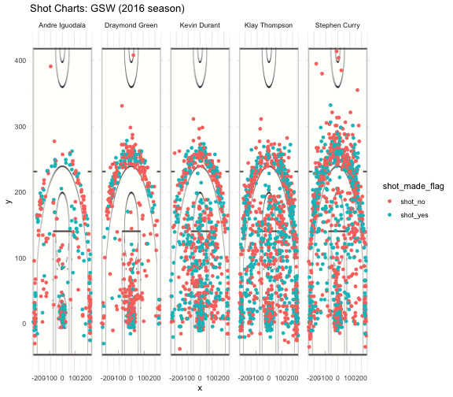

```{r setup, include=FALSE}
knitr::opts_chunk$set(echo = TRUE)
```

```{r}
library(dplyr)
library(ggplot2)
library(grid)
library(jpeg)

data_types = c("team_name"="character", "game_date"="character", "season" = "integer", "period"="integer", "minutes_remaining"="integer", "seconds_remaining"="integer", "shot_made_flag"="character", "action_type"="factor", "shot_type"="factor", "shot_distance"="integer", "opponent"="character", "x"="integer", "y"="integer")

players <- read.csv('../data/shots-data.csv', stringsAsFactors = FALSE, colClasses=data_types)

two_point <- players[players$shot_type == "2PT Field Goal",]
two_group <- group_by(two_point,name)
two_sum <- arrange(
  summarise(
    two_group, 
    total = length(shot_made_flag),
    made = sum(shot_made_flag == 'shot_yes'),
    perc_made = made/total), 
  desc(perc_made))
#2pt effective shooting % by Player
two_sum

three_point <- players[players$shot_type == "3PT Field Goal",]
three_group <- group_by(three_point,name)
three_sum <- arrange(
  summarise(
    three_group, 
    total = length(shot_made_flag),
    made = sum(shot_made_flag == 'shot_yes'),
    perc_made = made/total), 
  desc(perc_made))
#3pt effective shooting % by Player
three_sum

total_group <- group_by(players,name)
total_sum <- arrange(
  summarise(
    total_group, 
    total = length(shot_made_flag),
    made = sum(shot_made_flag == 'shot_yes'),
    perc_made = made/total), 
  desc(perc_made))
#effective shooting % by Player
total_sum
```

## Report

### Introduction
Golden State Warriors is by no doubt the best team in the National Basketball Association in recent years. The team has gathered the best players in the United States, and among them, the best and most influential ones are Stephen Curry, Kevin Durant, Andre Iguodala, Draymond Green, and Klay Thompson.
Stephen Curry is a six-time NBA All-Star Player, has been named the NBA Most Valuable Player twice, and won three NBA championships with the Warriors. Kevin Durant has won two NBA championships, an NBA Most Valuable Player Award, two Finals MVP Awards. Andre Iguodala was an NBA All-Star and has been named to the NBA All-Defensive Team twice. Iguodala won an NBA championship with the Warriors in 2015, when he was named the NBA Finals Most Valuable Player. Green, who plays primarily at the power forward position, is a three-time NBA champion and a three-time NBA All-Star. Klay Thompson is credited as one of the greatest shooters in NBA history. He is a five-time NBA All-Star and a three-time NBA champion. 

Given the glamorous record of the players, you might be wondering how are they performing exactly on courts. This reprot gives you an idea about the players' shotting performance on courts and how their shots mapped out on a basketball court.

### Motivation
The Golden State Warriors has the highest paid players and the most well performed players. By analyzign their performance visually and statistically on courts, we can better understand their strengths and weaknesses, and improve the performance of the entire team by using strategies based on the data.

### Background
The Golden State Warriors is an American professional basketball team based in Oakland, California.
Key players including:
- Andre Iguodala
- Draymond Green
- Kevin Durant
- Klay Thompson
- Stephen Curry
The team did not perform as well as people expected during the 2016 season; therefore, we would like to draw some insights from the individual player's shot chart.

### Data
The datasets considered variables including:
1.**period**: an NBA game is divided in 4 periods of 12 mins each. For example, a value for period = 1 refers to the first period (the first 12 mins of the game).
2. **minutes_remaining** and **seconds_remaining** have to do with the amount of time in minutes and seconds, respectively, that remained to be played in a given period.
3. **shot_made_flag** indicates whether a shot was made (y) or missed (n).
4. **action_type** has to do with the basketball moves used by players, either to pass by defenders to gain access to the basket, or to get a clean pass to a teammate to score a two pointer or three pointer.
5. **shot_type** indicates whether a shot is a 2-point field goal, or a 3-point field goal.
6. **shot_distance**: distance to the basket (measured in feet).
7. **x** and **y** refer to the court coordinates (measured in inches) where a shot occurred.
8. **team_name** refers to the name of the NBA team.
9. **game_date** refers to the date that the game took place.
10. **season** is the NBA season during which the game took place.
11. **Opponent** is the team that they are playing against.

### Analysis
The raw datasets including the shot datas of Stephen Curry, Kevin Durant, Andre Iguodala, Draymond Green, and Klay Thompson.

We manipulated the raw datasets and created a shot chart of the players' performance on court.

```{r}

```

Based on the graphs, we can see that Klay Thompson, Stephen Curry, and Kevin Durant made the majority of the shots, and while Andre Iguodala and Draymond Green made relative small numbers of shots. This aligns with their position within the team. We can further observe that Stepehn Curry is the best at making long distance shots while Andre Iguodala is not good at makign long distance shots.

In addition to the visual representation, we can also use tables to summarize key findings from the data. We then made a summary of each player's 2pt effective shooting percentage, 3pt effective shooting percentage, and overall effective shooting percentage. We can see that Kevin Durant has the highest percentage of effective shooting while Draymond Green has the lowest percentage of effective shooting.

### Discussion
For 2 points shooting perfomance, Andre Iguodala has the highest effective shooting percentage while Draymond Green has the lowest effective shooting percentage.
For 3 points shooting performance, Klay Thompson has the highest effective shooting percentage while Draymond Green has the lowest effective shooting percentage.
For overall shooting performance, Kevin Durant has the highest effective shooting percentage while Draymond Green has the lowest effective shooting percentage.

### Conclusion
Overall, the Golden State Warriors has the best players and all performed well with high effective shooting percentages.

### Reference
https://github.com/ucb-stat133/stat133-hws/blob/master/data/andre-iguodala.csv
https://github.com/ucb-stat133/stat133-hws/blob/master/data/draymond-green.csv
https://github.com/ucb-stat133/stat133-hws/blob/master/data/kevin-durant.csv
https://github.com/ucb-stat133/stat133-hws/blob/master/data/klay-thompson.csv
https://github.com/ucb-stat133/stat133-hws/blob/master/data/stephen-curry.csv


